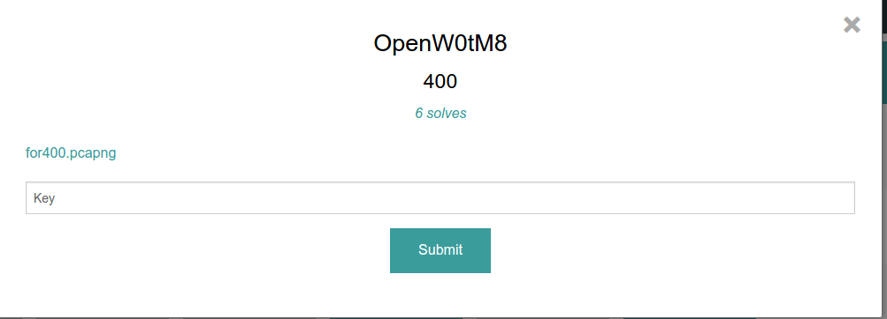
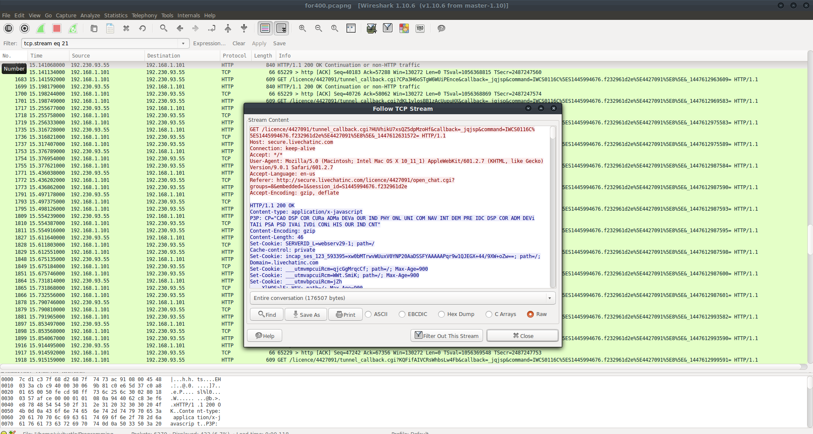
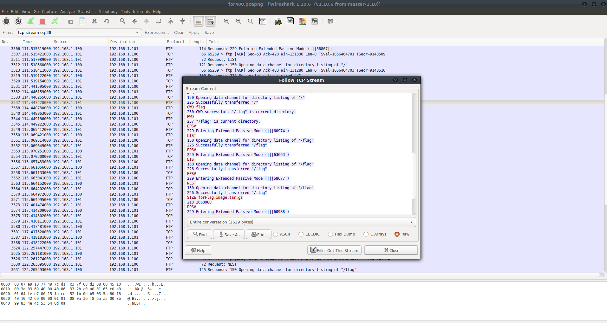
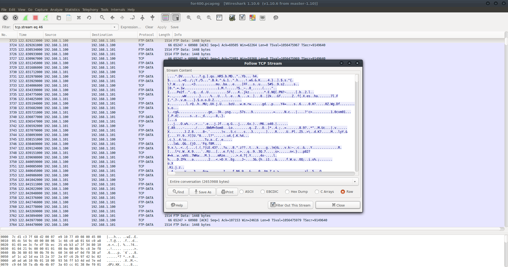
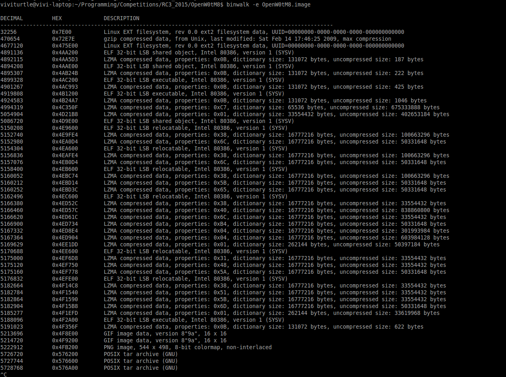

OpenW0tM8: Forensics 400
----------------------




This wasn't so bad for a 400 Forensics question. I spent a good few hours trying to find the flag for this, even though it should of taken only 30 minutes.

We are given a link to a pcap file: [for400.pcapng](for400.pcapng). Whenever I do any CTF, I ALWAYS strings the file. Given that the string layout is "RC3-XXXXX-XXX", I stringed the pcap file looking for "RC3" and flag" 

> strings for400.pcapng | grep RC3

> strings for400.pcapng | grep flag

Nothing came for "RC3", however we did get a bit of information for flag.

```
strings for400.pcapng | grep flag
_drwxr-xr-x 1 ftp ftp              0 Nov 15 13:31 flag
flag
CWD flag
250 CWD successful. "/flag" is current directory.
257 "/flag" is current directory.
o_150 Opening data channel for directory listing of "/flag"
o_226 Successfully transferred "/flag"
v4150 Opening data channel for directory listing of "/flag"
v4226 Successfully transferred "/flag"
150 Opening data channel for directory listing of "/flag"
226 Successfully transferred "/flag"
*150 Opening data channel for file download from server of "/flag/forFlag.image.tar.gz"
+226 Successfully transferred "/flag/forFlag.image.tar.gz"
```


Given this information, we know that the flag is in a directory called "flag" containing a file called forFlag.image.tar.gz. We can assume this tar.gz has the flag inside it.

Knowing this information, it was time to enter Wireshark, our great packet analysis tool and extract the data transfer. Upon opening the pcap, we can follow a few TCP streams (right click packet > Follow TCP Stream) to find some kind of secure webchat on some website.



```
GET /licence/4427091/tunnel_callback.cgi?ya3hbWK4jtBrljUv0ZPN&callback=_jqjsp&command=IWCS0116C%5ES1445994676.f232961d2e%5E4427091%5E8%5E&_1447612614575= HTTP/1.1
Host: secure.livechatinc.com
Connection: keep-alive
Accept: */*
User-Agent: Mozilla/5.0 (Macintosh; Intel Mac OS X 10_11_1) AppleWebKit/601.2.7 (KHTML, like Gecko) Version/9.0.1 Safari/601.2.7
Accept-Language: en-us
Referer: http://secure.livechatinc.com/licence/4427091/open_chat.cgi?groups=8&embedded=1&session_id=S1445994676.f232961d2e
Accept-Encoding: gzip, deflate

HTTP/1.1 200 OK
Content-type: application/x-javascript
P3P: CP="CAO DSP COR CURa ADMa DEVa OUR IND PHY ONL UNI COM NAV INT DEM PRE IDC DSP COR ADM DEVi TAIi PSA PSD IVAi IVDi CONi HIS OUR IND CNT"
Content-Encoding: gzip
...
```

This chat is throughout the whole packet capture, although not much data can be extracted from it. I'm guessing the client was talking to someone and trying to get the flag.gz files from this website.

Since we know that there was a file transfer for forFlag.image.tar.gz, we can assume the File Transfer Protocal (FTP) was used. Let's look at some FTP Data. Around the 3000 packet mark, we find some FTP stuff. 


```
211 End
PWD
257 "/" is current directory.
EPSV
229 Entering Extended Passive Mode (|||58867|)
LIST
150 Opening data channel for directory listing of "/"
226 Successfully transferred "/"
EPSV
229 Entering Extended Passive Mode (|||62461|)
NLST
150 Opening data channel for directory listing of "/"
226 Successfully transferred "/"
CWD flag
250 CWD successful. "/flag" is current directory
...
```

Looking inside the stream, we see that our strings data from earlier is here. Since we know the file was transferred around the 3000 mark, let's look for the actual packet transfer in this range of packets. Upon finding it (TCP_Data), we can "Follow TCP Stream" for this file transfer. (Note we cannot export objects to get FTP data)


```
....^.DV.....\...?.g.].qu..HR5.b.MD.."..Yb... h4.$.....L.=Q../;;Y./5...^.B.k.^.&.1..".h....!.wG.&.K....4.}..].$.s.^{.\?.W....y....<3...........mu..ba...e....[FF...s..u....5#S..9.s2.....s..[0.^.=.1w..................i.M.!.....?$._~..0_.....(...."..{....Pe2f..^..q...d..U..........5F....K..jkz........*.E.NQ[.PN?~.....[.b..2.l..+..,....wW.......}.....%...U...l..e...N....x..]...8..|2k...Gf......Z..f{.X.es..ha.......7l.F{.".7-.v.m....}.$.o.o.D.Z..._...........+.........l.rQ..h..MU;.UV.j.U....b
```

A whole bunch of gibberish, so we can assume this is some kind of non-text fille. Since we know the flag is in this data, let's save it as raw data and see what we can do to pull the flag from here. I saved it as [FTP_DATA](FTP_DATA_ORIGINAL) (In this case it's saved as FTP_DATA_ORGINAL in this repo) and started analyzing the data.


Let's dissect what we did here.

I used the file command to see what the data was:

> file FTP_DATA

> TCP_DATA: gzip compressed data, from Unix, last modified: Thu Nov 12 08:37:50 2015, max compression

We were right. This is the forFlag.image.tar.gz file. I renamed it to TCP_DATA.gz and extracted it.

>mv TCP_DATA TCP_DATA.gz

>zip -d TCP_DATA.gz

I than did another file command to check to see what resulting file was.

> file FTP_DATA

>CP_DATA: POSIX tar archive

This only confirms that this is our file: forFlag.image.tar.gz
I renamed it to TCP_DATA.tar and extracted it again.

> mv TCP_DATA TCP_DATA.tar

>tar -xvf TCP_DATA.tar 

>./._OpenW0tM8.image

I checked to see what file it was again to confirm it was an image: 

>file OpenW0tM8.image

>OpenW0tM8.image: x86 boot sector

So now we have an image. When we have an image I always do the three things.

1) Strings
2) foremost
3) binwalk
4) Manual mount and analysis

Using strings and foremost we didn't find anything except a few htm's and images. If you guys don't know what foremost is, it's a tool to carve out files from another file. It pretty much looks at header and footer bytes to check for file signatures. Looking into them didn't really give me much. All of it is saved in the output folder.

Last thing I did was binwalk -e (-e for extract)

> binwalk -e OpenW0tM8.image



This gave us a bunch of files. A lot of it we can ignore. Towards the end we can see a few tar files. Upon opening the [576200.tar](576200.tar) file up, we get something very interesting. A [read](read) file, a [key](key), [decme.enc](decme.enc).

[read](read)
> openssl enc -d -in {encrypted file} -out {output file} -kfile {key} -aes-256-ecb

[key](key)
```
60e9 8211 8077 1fc5 69b8 29f1 3e00 d8c2
ce9a 7523 e8b7 44bc 48a4 3815 72b6 546a
```

[decme.enc](decme.enc)
>Salted__vg*©ÄÛ»¡¿SÏÛÏðíïIÊÌd8³

Lets try doing this in the command line with the corresponding files.

```
openssl enc -d -in decme.enc -out flag -kfile key -aes-256-ecb
cat flag
RC3-WOTM-8080
```

And thus, the flag is RC3-WOTM-8080. Woo.